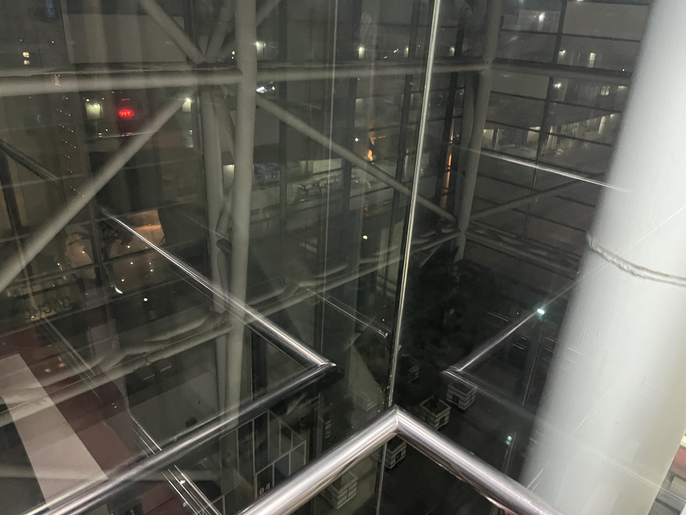

# HEADER PREMIÈRE

dsdasdasda

## Header Deuxième

dasdasda

### Header Troisième

dasdm

## Header quatrième aussi...

damdk

###  salut mec

> Ils s'appellent Rêveur

### Xxx. mdr

> en vrai?

_Image Caption_

dsdsds
ss

{:width="70%" class="normal"}_Image Caption_

## faire semblant t'aimer

déjà sait

### NOUVELLE

- 

	- 
 -  
   -  
     -  
       - 

***

***

dire.. quelque chose

fatigué, comme après un long voyage

> une traversée, dans l'enfer, d'une cage
>
> une odeur rance, un sentiments d'asphyxie
>
> je sors d'une transe, ma colère est fini

et nous aussi, on a plus rien à se dire

fatigué, comme après un long, voyage. une traversée, dans l'enfer, d'une cage. une odeur rance, un sentiment d'asphyxie. je sors d'une transe, ma colère est fini. et nous aussi, on a plus rien à se dire. plus le moindre instant à s'offrir. je ne sais même plus lire ton visage.  
je n'comprends plus tes mots. on a tournée la page. on a rentré les crocs. mais ne m'en veux pas, si je pense encore à toi. c'est que je regoûte, en silence, à cette-vie là.

j'ai fait le tour et notre amour est en cavale. il nous à volé, une année à tous les deux. laisse le partir, on vas pas crier au scandale. on le retrouvera peut-être quand on sera vieux  
`on s'est laisser sombrer sans histoire` à quoi bon se faire du mal si on perd l'envie

etincelle [parapluie](#header-secondaire) est bon  
mais [c'est](#header-secondaire-aussi) aussi pas mal $x-\frac{t^{-1}}{a}=\int_{a}^{t}{(\lim\below{x\rightarrow t^2}{x-2a})dx}$

| H1   | H2   | H3   |
| ---- | ---- | ---- |
|      |      |      |

