<div class="notice">
홍정모 교수님의 자료구조 강의에 기반한 글입니다.<br>
🌟<a href="https://honglab.co.kr/courses/data-structures" target="_blank">들으러가기</a>
</div>

## Tower of Hanoi

하노이의 탑은 3개의 기둥 중 어느 한 곳에서 크기가 가장 큰 것 부터 가장 아래로 깔려져있는 디스크들을 같은 정렬 방식으로 다른 기둥으로 옮기는 게임이다.

이를 재귀함수, stack를 이용하여 구현해보자.

<figure style="text-align: center; zoom:50%;">
    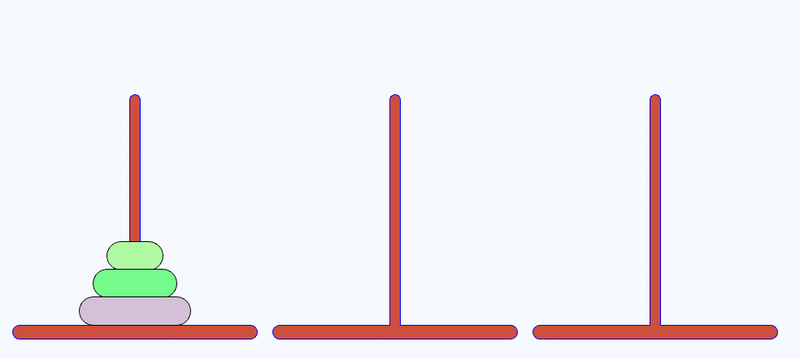
    <figcaption style="font-size: 24px; color: gray;"><a href="https://www.mathsisfun.com/games/towerofhanoi.html" target="_blank">플레이하러 가기</a>
    </figcaption>
</figure>


## 기본 소스코드


```c++
#include <iostream>

#include <share/stack.h> //전 강의에서 구현한 stack, 없으면 std::stack이용

using namespace std;

Stack<char> tower[3];
```

ㅤ

- PrintTowers()
  - stack형인 `tower`의 내장함수 `Print()`를 이용하여 인덱스별 원소 출력

```c++
void PrintTowers()
{
	cout << "Towers" << endl;
	cout << "0: ";
	tower[0].Print();
	cout << "1: ";
	tower[1].Print();
	cout << "2: ";
	tower[2].Print();
}
```

ㅤ

- MoveDisk()
  - 각 기둥<span class="faded_italic-text"> tower[n] </span>에서, `from`의 가장 위에 있는 요소를 `to`로 이동
    - `to`가 비어있는 stack이면 X
    - `tower[to].Top() > disk`시 오류이므로, 목적지의 `Top`이 가져오는 `Top`보다 작아야한다.
      => A B C ... 순서로 쌓인다<span class="faded_italic-text dimmed-text">(ascii)</span>

```c++
void MoveDisk(int from, int to)
{
	if (tower[from].IsEmpty())
	{
		cout << "Tower " << from << "is empty." << endl;
		exit(0); // 오류 강제 종료
	}

	auto disk = tower[from].Top();

	//받을 타워가 비어 있으면 뭐든지 받을 수 있음
	//알파벳 순서여야 받을 수 있음 (역순 X)
	if (!tower[to].IsEmpty() && tower[to].Top() > disk)
	{
		cout << "Cannot place " << disk << " on " << tower[to].Top() << endl;
		exit(0); // 오류 강제 종료
	}

	tower[from].Pop();
	tower[to].Push(disk);

	cout << "Move disk " << disk << " from " << from << " to " << to << endl;
	PrintTowers();
}
```

ㅤ

- `num_disks`는 스택(기둥)에 쌓을 초기 요소 개수
  - ex) A, B, C
  - `RecurMoveDisks(num_disks, from, temp, to)` => 구현해야하는 디스크 이동정렬 함수

```c++
int main()
{
	int num_disks = 3;

	for (int i = 0; i < num_disks; i++)
		tower[0].Push('A' + i);

	PrintTowers();

	RecurMoveDisks(num_disks, 0, 1, 2);

	PrintTowers();

	return 0;
}
```

ㅤ

- 구현부 ↴

```cpp
void RecurMoveDisks(int n, int from, int temp, int to)
{
  //TODO:
}
```

ㅤ

## 규칙 찾기

### 직접 규칙찾아보기

먼저 <a href="https://www.mathsisfun.com/games/towerofhanoi.html" target="_blank">플레이하러 가기</a> 에서 간단하게나마 3개부터 시작하여 차차 디스크 개수를 늘려가며 하노이의 탑을 플레이해보자.

하노이의 탑을 처음 접해본 입장에서는 3정도는 쉽게 풀다가 4, 5개 부터는 확실히, 매우 난해했다. 수십번을 플레이해봐도 도저히 어떻게 스탭들을 규칙적으로 밟아야 하는지 감도 못 잡은 채 문제 보기만 2시간을 하며 헛발질을 했다.

직감으로는 전혀 못풀것같은 느낌.. 규칙을 정리해야겠다는 생각을 했다.

<div class="notice">
그래도 찾은 하나의 작은 가이드라인은,<br>
타겟 기둥으로 갈 때 가장 아래 디스크 제외, 나머지 상체부분을 일단 임시 기둥에 전부 옮겨놓고<br>
가장 아래 디스크를 제일 먼저 타겟 기둥으로 옮겨야 한다는 것<br>
<span class="faded_italic-text dimmed-text">(가장 바닥부터 차차 메꾼다는 느낌)</span>
</div>

나는 이 추정으로 아래처럼 논리를 확장해갔다.

### 논리 점화

`디스크`가 4개 있다고 해보자. 전부`from`에서  `to`로 최소한의 횟수로 옮기는 것이 목표이다.

> 편의상 n-3, n-2, n-1, n 와 같이 쌓이는 것으로 표현

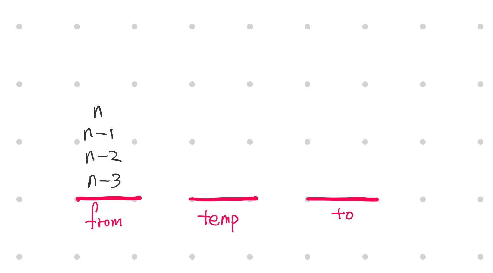

가장 아래 디스크 `n-3`을 옮기려고 봤지만, 위 디스크  `n-2`, `n-1`, `n` 때문에 옮기지 못한다.  
위에 쌓여있는 디스크들을 `먼저`해결해보자.

> 편의상 잠시 n-3을 잠시 가려보자

<br>

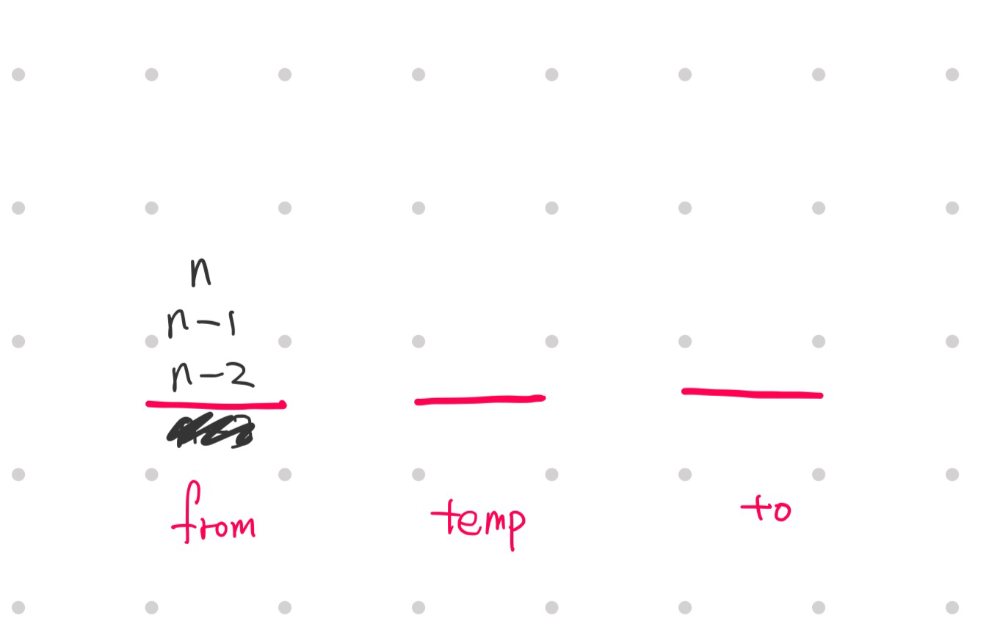

가장 아래 디스크 `n-2`를 옮기려고 봤지만, 위 디스크  `n-1`, `n` 때문에 옮기지 못한다.  
위에 쌓여있는 디스크들을 먼저 해결해보자.

> 문제가 잘게 쪼개짐이 보인다.  
> 편의상 n-2를 잠시 가려보자

<br>

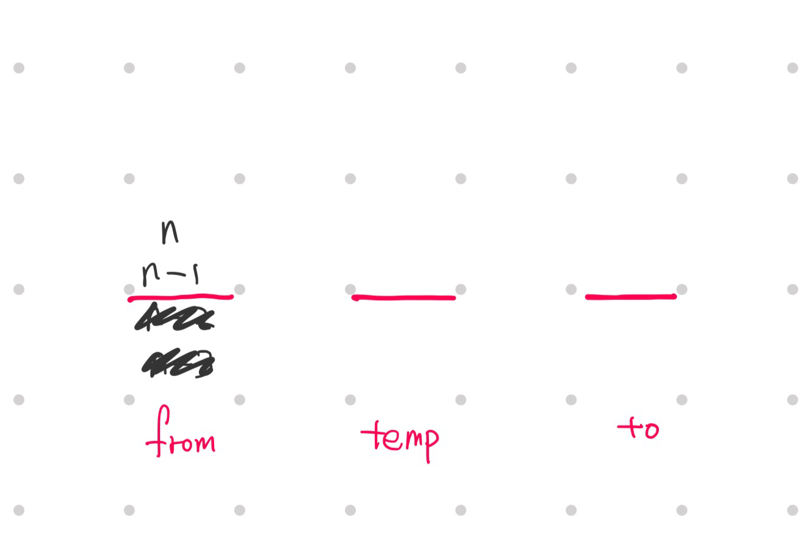

여기서부터는 마지막 두 디스크 `n-1`, `n`이남는다.  
<span class="faded_italic-text dimmed-text">또 `n-1`를 가려 마지막 하나 `n`을 남겨 따져보는 것은 아무런 의미가 없다.</span>

결국 마지막 2개 디스크 간의 이동 논리가 이 문제 해결 과정의 `최소 단위 논리`가 된다.

결국 여기서 `from`부터 `to`까지의 이동과정을 보여라인데, 너무 쉽다.  
`n`을 잠시 `temp`에 두고 바닥 `n-1`을 `to`로 옮기고 `n`을 `to`에 있는 `n-1`에 쌓으면 된다.

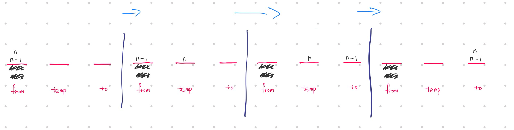

---

<!-- ### 관계식 세우기

위의 이동 논리는 디스크 이동의 `최소 논리 단위`이니 이동 양상을 관계식으로 세워보고  
다른 디스크의 개수 문제에서도 적용 되는지 따져보아 가설을 검증해나가는 귀납적 추론을 해봤다.


전제조건은 디스크의 개수는 2개일 때.  
아래 디스크를 `me`, 나머지 위의 디스크를 `head`, 시작점을 `f`, 임시 공간을  `tm`, 목적지를 `to`라고 하자.

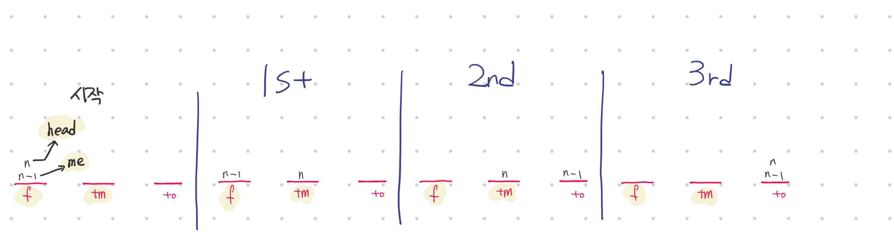

이때 각 3단계 마다 이루어지는 이동을 다음과 같이 정리해볼 수 있다.

> 1st : `head` → `tm`  
> 2nd: `me` → `to`  
> 3rd: `tm`에 있던 me → `to`  


- 그리고 다음을 관계식으로 세워봤다
  - 1st : `head` → `tm` 
  - 2nd : `me` → `to`  
  - 3rd  : `tm` → `to` <span class="faded_italic-text dimmed-text">tm에 있던 것이 to로 감</span>
  - \+ 기호는 단계 구분이다. 1st, 2nd, 3rd...

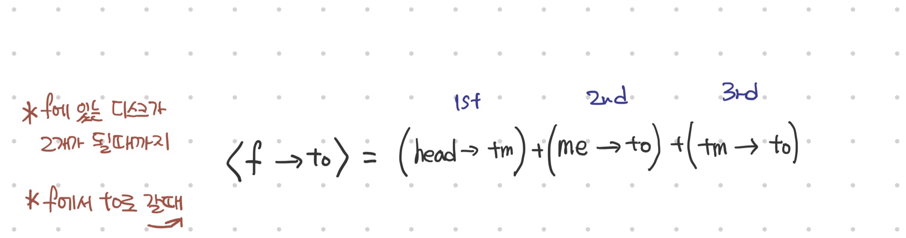

---

### disk가 3개일 때 귀납추론 검증

<div class="flex-container">
    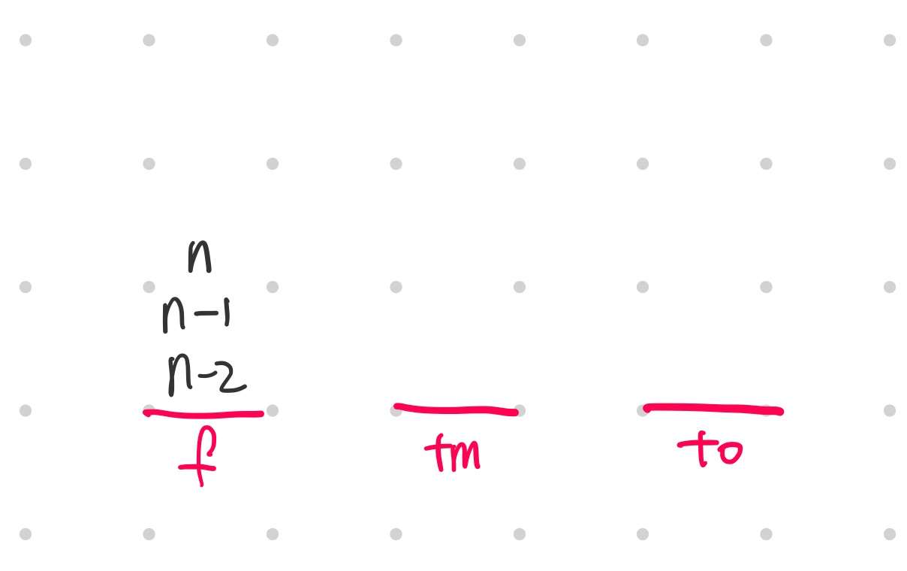
    <div class="flex-text">
여기서 가장 아래 디스크 n-2가 me이고,<br>나머지 윗 부분 n-1, n은 head이다.
    </div>
</div>

<br>

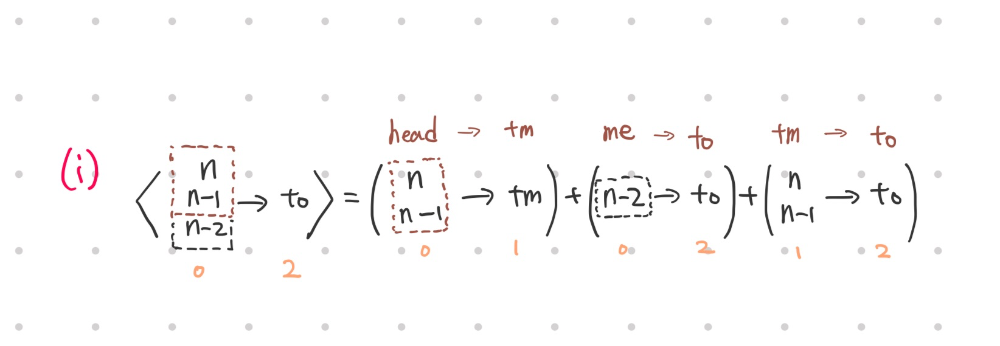

> 첫 번째 단계 (i) 는 다음과 같이 전개된다. 첫째항에서 시작점에 디스크가 2개가 있으니 또 관계식을 적용해준다.  
> 여기선 첫째항, 셋째항에 또 관계식 적용이 가능하다.<span class="faded_italic-text dimmed-text">디스크 한 개의 이동들로 다 쪼갠다.</span>
>
> 항에서 또 관계식으로 분화하며 가지가 나듯이 이는 나중에 쓰게 될 재귀함수의 개념과 유사하다. 

<br>

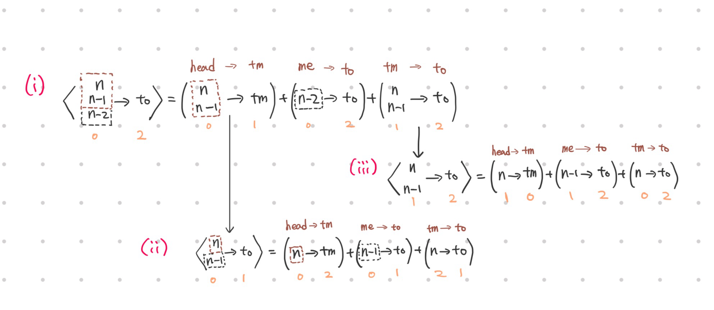

> (i)의 첫번째 항에 관계식을 또 적용하면 (ii)가 생긴다. 이는 재귀함수가 실행될 때 마다 스택이 쌓이는 것과 같다.
>
> 먼저 (i)의 첫째항인 (head<span class="faded_italic-text dimmed-text">from자리</span> → tm)이 (ii)에선 <f → to>로 대치된다.<span class="faded_italic-text dimmed-text">(i)의 (f→tm) ⇒ (ii)의 <f→to> = ... </span>   
> <span class="faded_italic-text dimmed-text">FLAGhead는 어차피 from에서 꺼내는 디스크이니 같다고 봐도 무방하다</span>
>
> 즉,  
>
> - (ii)의 f는 (i)의 f와 같다.  
> - (ii)의 to는 (i)의 tm와 같게 된다.<span class="faded_italic-text dimmed-text">(ii)에서 to로의 이동을 전역적으로 보면 원래의 tm에 이동한다는 말과 같다.</span>  
> - (ii)의 tm은 남는 (i)의 to와 같게 된다. <span class="faded_italic-text dimmed-text">어차피 f, to가 아니면 남는게 tm이다. + 일대일대응</span>

결국 (ii)의 to는 원래 기둥 3개에서<span class="faded_italic-text dimmed-text">기둥[0], 기둥[1], 기둥[2]</span> tm자리 인덱스[1] 자리를 가리키게 된다.  
__나의 f, tm, to와 윗쪽의 f, tm, to는 다른 자리, 다른 스택임을 주의하자.__

> 🌟왜 대응관계의 꼬임이 일어나는가??  
> __(i)의 첫째항인 (f<span class="faded_italic-text dimmed-text"> = head</span> →tm)에서 f, tm이 (ii)의 <f → to> = ... 의 각각의 인자에 들어가기 때문이다.__   
> 따라서 원래 (i)의 f는 (ii)에서 f로 다뤄지게되는 반면,  
> 원래 (i)의 tm은 (ii)에서는 to로 다뤄지게 된다.  
> <span class="faded_italic-text dimmed-text">*f는 시작점, to는 목적지의 의미이다*</span>

헷갈리면 하단의 오랜지색 인덱스 값을 참고하자. 글로벌 변수처럼 절대값이기 때문이다.

> (i) 첫째항에서 가지처럼 뻗어난 (ii)의 첫째항은 비로소 디스크 하나 짜리가 보인다. 이는 우리가 이동시켜 줄 수 있는 단위이며 더 이상 쪼갤 수 없다. 
>
> (ii)의 세 항별 디스크 이동을 살펴보면 다음과 같다.

<br>

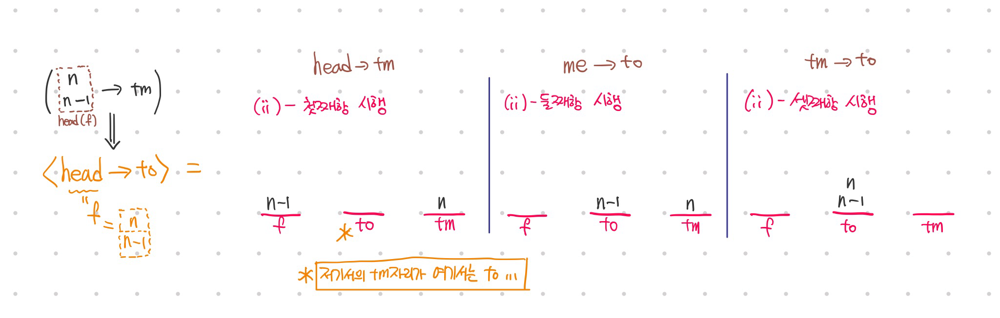

> (ii) 시행이 모두 끝나면 (i)의 첫째항으로 복귀한다. 재귀함수의 뻗었던 가지 거둬들이기랑 비슷해보인다.<span class="faded_italic-text dimmed-text">반환을 이용한 복귀</span>
>
> (i)의 둘째항으로 넘어가 시행하면 다음과 같다.

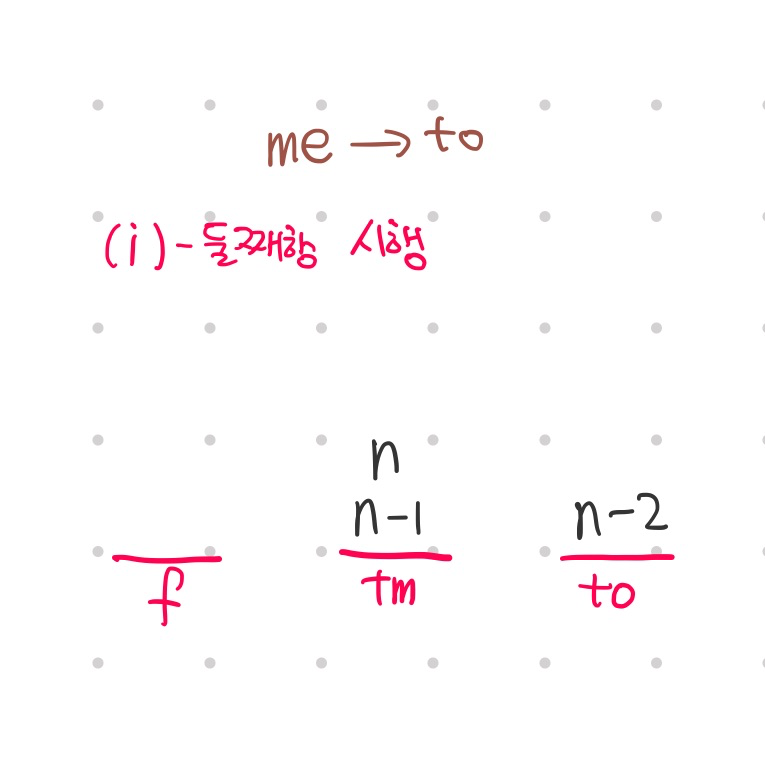

> (i) 둘째항 시행이 끝나면 (i) 셋째항으로 넘어가고 (i)의 셋째항 역시 시작점에 디스크 두 개가 있으니 이동 관계식을 적용시키면  
> (iii)로 전개된다.

> (i)의 셋째항인 (tm → to)가 (iii)의 <f → to>로 대치된다. <span class="faded_italic-text dimmed-text">(i)의 (tm→to) ⇒ (iii)의 <f→to> = ...</span> 
>
> 즉,  
>
> - (iii)의 f자리에 (i)의 tm이 들어오니, (iii)의 f = (i)의 tm
>
>   (iii)의 to자리에 (i)의 to가 들어오니, (iii)의 to = (i)의 to
>
> - (iii)의 tm = (i)의 f
>
> (iii)의 세 항별 이동을 살펴보면 다음과 같다.

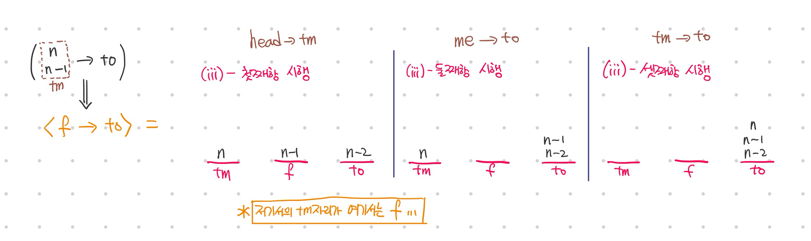

(iii)이 끝나면 (i)의 셋째항으로 돌아가고 결국 전부 끝나게 되어 가정한대로 살펴본 예시 케이스에서도 이동 관계식은 적용됐다.

***

### disk의 개수가 4+... 개일 때

4개일 때도 역시 같은 방법으로 하면 최소횟수로 완벽하게 이동된다. 다만 4개이므로 도식을 그리는 데는 좀 걸린다.  
5, 6개도 역시 된다.   
물론 위에서 소개한 꼬리에 꼬리를 무는 `나머지 위 디스크들을 잠시 다른 데로 옮기기` 가 이 식과 이미 같다.

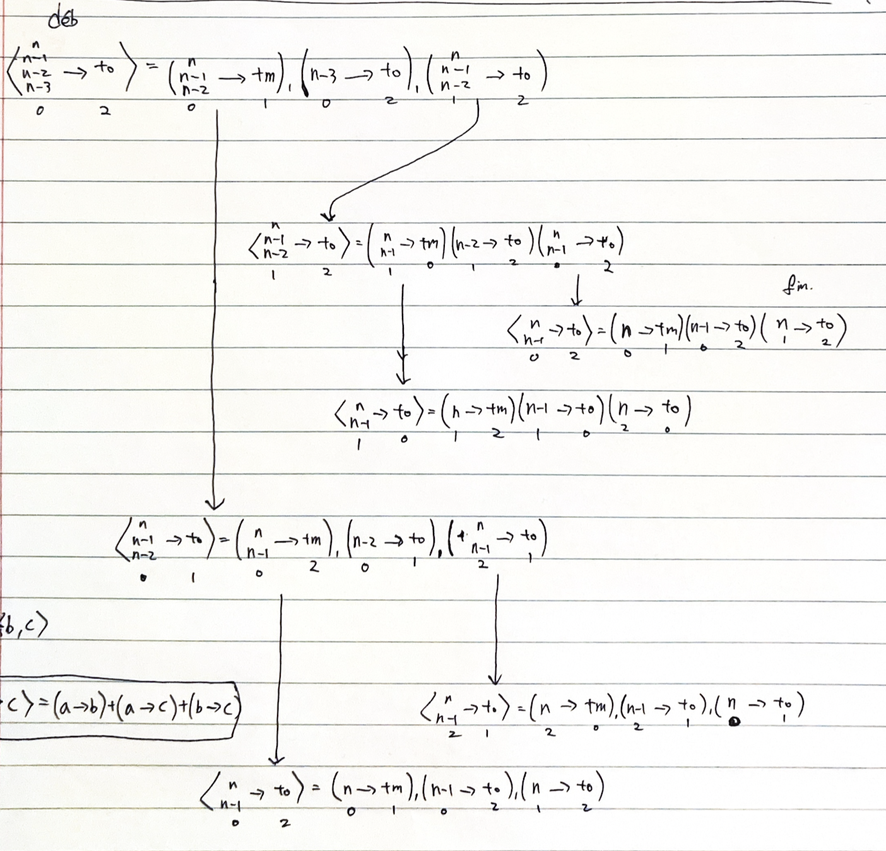

---

## 코드 구현

### 재귀 부분

```c++
#int main()
RecurMoveDisks(num_disks, 0, 1, 2);
```

인자로 `num_disks`는 3, `from`은 인덱스 0, `tm`, `to`는 1, 2를 넣는다.  
구현에는 재귀함수를 쓰지만 무한재귀를 하지는 않을 것이기 때문에 시작과 종료 condition역시 잘 정해야 한다.

일단 내가 구현하려 했을 때 딱 처음에 했던 생각은 아래 사진의 노란색 하이라이트 된 화살표처럼  
한 항에서 또 재귀적으로 새로운 식이 열리는 코드를 어떻게 구현할 것인지였다.

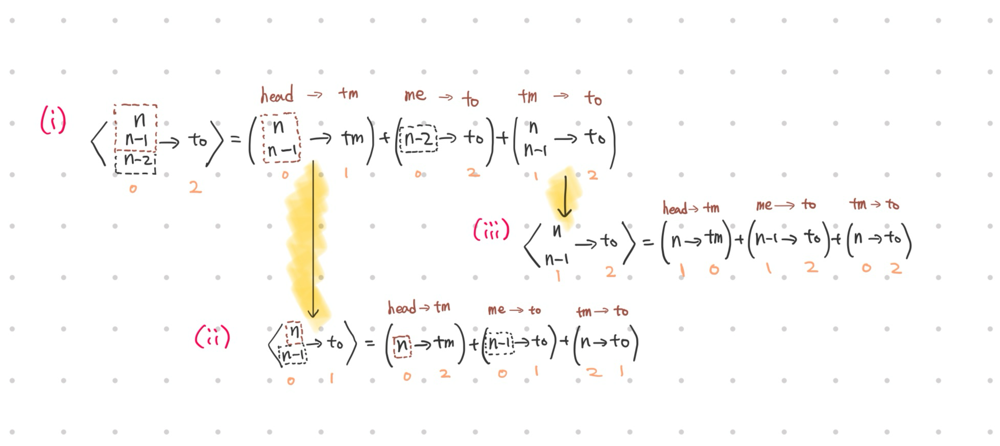

그래서 일단 `RecurMoveDisks()`를 3개를 나란히 두었다. 하지만 재귀가 필요한 항은 첫째항과 셋째항이다.  
둘째항은 디스크 1개를 옮기는 것이므로 디스크 하나를 옮기는 `MoveDisk()`를 사용한다.

```c++
	RecurMoveDisks( , , , ); // 1st term
	MoveDisk( ,); // 2nd term
	RecurMoveDisks( , , , ); // 3rd term
```

<br>

이제는 인수들을 채워야한다. 첫째항인 1st term을 다시 위의 사진에서 한 번 보자.  
새로 재귀식을 열 때 <f→to>에서 `f`인자에 자신의 `f`를 넣고, `to`인자에 자신의 `tm`를 넣는다. 

`→ RecurMoveDisks(..., from, to, temp);`<span class="faded_italic-text dimmed-text">남는 인수자리는 to거 ㅎㅎ..</span>

<br>

둘째항인 2nd term은 `me` → `to`를 수행하는데, `me`는 `from`자리에 있기 때문에   
`from`인수에 자신의 `from`을, `to`인수에 자신의 `to`를 넣는다.  
`→ MoveDisk(from, to);`

<br>

셋째항인 3nd term은 `tm` → `to`를 수행한다.  
새로 재귀식을 열 때 <f→to>에서 `f`인자에 자신의 `tm`를, `to`인자에 자신의 `to`를 넣는다.

`→ RecurMoveDisks(..., temp, from, to);`

---

### 재귀 종료 조건 부분

도식을 보면 알 수 있듯이 무한히 재귀하지 않듯이 좀 자세히 보면 언제 재귀를 멈추는지 알 수 있다. 

일단 가장 처음 함수가 실행될 때 n에는 3이 들어온다.   
초기에는 (i)로 전개가 되는데 3가 매칭되는 요소는 <f→to>에서 `f`의 디스크 개수이다.   
따라서 이와 관련하여 종료 조건을 짜면 될 것 같았다.

그렇다면 재귀함수를 실행하는 부분 위에 조건 검사식을 둬야함을 알 수 있다. 아래는 최종코드이다.

```c++
void RecurMoveDisks(int n, int from, int temp, int to)
{
	if (n == 1)
	{
		MoveDisk(from, to);
		return;
	}

	RecurMoveDisks(n - 1, from, to,temp); // 1st term
	MoveDisk(from, to); // 2nd term
	RecurMoveDisks(n - 1, temp, from, to); // 3rd term

}
```

- 재귀에서 재귀로 또 들어갈 때 무슨 인자를 넣어주는지는 어려울 것 없다. 내 `from`, `temp`, `to`등이 새로운 재귀식에서 어떤 자리를 맡게되는지를 따지는 것이다.

- (i)는 <f→to>에서 `f`가 디스크를 3개 가지고 있다. 다음 재귀 때 `n-1`을 해주자.

- (ii)는 <f→to>부분에서 `f`가 디스크 2개를 가지고 있다. 재귀는 여기까지만 되어야 한다. 일단 다음 재귀 때 역시 `n-1`을 해주자.

  - 그렇다면 예컨대 (ii)의 첫째항에서는 다시 `n`을 `-1`을 한 재귀식이 실행된다.

  - 일단 새로 열린 재귀함수에서 `n`은 1이 된다. 여기서는 재귀를 멈춰야 하므로 `if (n==1)`을 걸고 맞다면  
    `MoveDisk(from, to);`을 하고 `return`을 하여 종료한다.  
    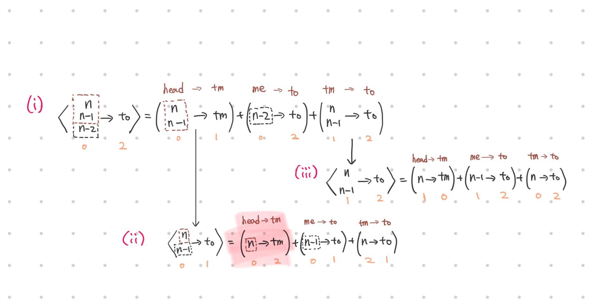  
    빨간색 하이라이트 부분을 보면 시작점은 `f`, 도착지는 `tm`이다.  
    일단 여기서 새로 열리는 재귀식에 `f`부분에 자기 `f`를, `to`부분에 자기 `tm`을 넣어주면 된다. = 이동을 f에서 tm로 하겠단 의미.    
    결국엔 새로 열린 재귀식에서 시작점 부분은 자기 `f`가, 도착지 부분에 자기 `tm`을 잘 넣었다. 이후부터는 각각 `f`, `to`로 대치된다.

    하지만 재귀 종료조건 `if (n==1)`에 걸린다. 그 후 `MoveDisk()`에는 원했던 시작점, 도착지인 `f`, `to`를 넣어주면 된다.  
    `→ MoveDisk(from , to);`   
    이후 `return`을 만나며 되돌아간다. 

이렇게 첫째항, 셋째항도 해결했다.

첫, 둘, 셋째 항들을 직렬로 배열했으니 첫째항의 가지들이 쭉 나갔다가 다시 거둬들여지고, 차례대로 둘.셋째도 마찬가지고 결국 함수가 끝난다.

---

주저리 주저리... 오지랖이 넓은 긴 설명이지만 하루동안 심히 시름했던 문제이었기에 내가 어떻게 풀었는지 자세히 기록하고싶었다.. -->
